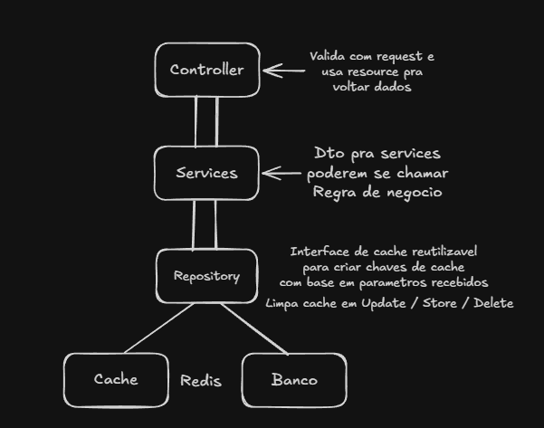

# Product API

API REST para gerenciamento de produtos, construída em Laravel 13, com autenticação por token, cache de listagem em Redis e cobertura de testes automatizados.

## Sumário

- [Funcionalidades](#funcionalidades)
- [Arquitetura](#arquitetura)
- [Tratamento de erros](#tratamento-de-erros)
- [Infraestrutura](#infraestrutura)
- [Stack](#stack)
- [Instalação](#instalação)
- [Rodando os testes](#rodando-os-testes)
- [Endpoints](#endpoints)
- [Filtros e paginação de `GET /api/v1/products`](#filtros-e-paginação-de-get-apiv1products)
- [Monitoramento com Laravel Telescope](#monitoramento-com-laravel-telescope)
- [Collection do Insomnia](#collection-do-insomnia)

## Funcionalidades

- **Autenticação por token** — registro, login e logout via [Sanctum](https://laravel.com/docs/sanctum), com revogação do token atual no logout.
- **CRUD completo de produtos** — criação, listagem, consulta, atualização e remoção, todas protegidas por autenticação.
- **Autorização por dono do recurso** — cada produto pertence a uma conta; tentar acessar/editar/remover um produto de outra conta retorna `403`, e um produto inexistente retorna `404` (via `ProductPolicy`).
- **Filtros e paginação** na listagem — por nome (parcial), faixa de preço (`min_price`/`max_price`) e faixa de quantidade em estoque (`min_quantity`/`max_quantity`), usando [Spatie](https://spatie.be/docs/laravel-query-builder).
- **Cache de listagem em Redis** — resultados de `GET /api/v1/products` são cacheados por combinação de filtros (via cache tags) e invalidados automaticamente em qualquer `create`/`update`/`delete`, evitando servir dados desatualizados.
- **Tratamento de erros padronizado** — todas as exceções da API passam por um renderer central que devolve sempre o mesmo formato de resposta (`{"message": "..."}`), nunca vazando mensagens internas de exceções não mapeadas.
- **Telescope** — [Laravel Telescope](https://laravel.com/docs/telescope) utilizado para melhor validar implementação do cache e queries ao banco.
- **Testes automatizados** — suíte de testes unitários e de feature (PHPUnit) cobrindo autenticação, autorização, filtros, cache e tratamento de erros, rodando em SQLite em memória (sem depender da infraestrutura real).
- **Collection do Insomnia pronta para uso** — todos os endpoints já configurados com variáveis de ambiente e autenticação Bearer herdada.

## Arquitetura

O fluxo de uma requisição segue: **Rotas → Controller → Service → Repository → Banco/Cache**.



- **Controller**: apenas chama o Service, passando um DTO (ou o `id` do recurso) construído a partir do `FormRequest` já validado, e devolve o resultado através de uma API `Resource`. Não contém regra de negócio nem busca dados diretamente — `show`/`update`/`delete` passam somente o `id`, e é o Service/Repository quem busca o model.
- **Service**: contém a regra de negócio, recebe/retorna DTOs (`App\DTOs\...`).
- **Repository**: único ponto de acesso a dados de Produto. Usa o [Spatie](https://spatie.be/docs/laravel-query-builder) para filtros/paginação e o Redis (via cache tags) para cachear a listagem, invalidando o cache em toda escrita (`create`/`update`/`delete`).
- **CacheKeyGenerator**: interface reutilizável que gera chaves de cache determinísticas a partir de um prefixo e um conjunto de parâmetros (usada pelos repositories).

Services, Repository e o gerador de chave de cache são todos definidos como interfaces (`App\Interfaces\...`) e resolvidos via injeção de dependência, com as implementações concretas registradas em `App\Providers\AppServiceProvider`. Feito assim para facilitar testes (mock das interfaces) e respeita o princípio de substituição de Liskov.

Essa separação em camadas traz benefícios diretos:

- **Testabilidade**: cada camada pode ser testada isoladamente, mockando apenas a interface da camada abaixo.
- **Baixo acoplamento**: trocar a implementação de cache, banco ou regra de filtro não exige alterar Controller nem Service.
- **Responsabilidade única**: regras de negócio, acesso a dados e formatação de resposta nunca se misturam no mesmo arquivo.

### Organização das pastas

Cada camada (`Interfaces`, `Services`, `Repositories`, `DTOs`, `Http/Requests`, `Http/Resources`, `Http/Controllers/Api/V1`) é dividida por domínio — `Products` e `Auth` — em vez de ter arquivos soltos na raiz da camada.

## Tratamento de erros

Todas as exceções lançadas em rotas de API passam por `App\Exceptions\ApiExceptionRenderer` (registrado em `bootstrap/app.php`), que além de padronizar a resposta em `{"message": "..."}` (mais `errors` para validação), evita blocos de try catchs obrigatorios em todas as controllers ajudando na legibilidade e evitando repetir codigo. Nunca deixa a mensagem real de uma exceção não mapeada vazar para o cliente:

| Exceção                                              | Status | Mensagem                                              |
|-------------------------------------------------------|--------|--------------------------------------------------------|
| `ValidationException`                                  | 422    | "Os dados fornecidos são inválidos." + `errors` por campo |
| `AuthenticationException`                              | 401    | "Não autenticado."                                      |
| `AuthorizationException` / `AccessDeniedHttpException`  | 403    | "Você não tem permissão para executar esta ação."       |
| `ModelNotFoundException` / `NotFoundHttpException`      | 404    | "Recurso não encontrado."                               |
| `MethodNotAllowedHttpException`                         | 405    | "Método não permitido."                                 |
| `TooManyRequestsHttpException`                          | 429    | "Muitas requisições. Tente novamente mais tarde."       |
| Qualquer outra exceção não mapeada                      | 500    | "Ocorreu um erro inesperado." (mensagem real nunca é exposta) |

O locale da aplicação é `pt_BR` (`APP_LOCALE`), com as mensagens de validação traduzidas em `lang/pt_BR/validation.php`.

Um cliente da API nunca precisa tratar formatos de erro diferentes por exceção — o contrato de resposta é sempre o mesmo, o que simplifica o consumo por front-ends e outros serviços.

## Infraestrutura

Todo o ambiente roda em containers Docker, orquestrados por `docker-compose.yml`, o que garante um ambiente idêntico em qualquer máquina.

| Container         | Imagem                  | Porta local | Papel                                                                 |
|-------------------|-------------------------|-------------|------------------------------------------------------------------------|
| `laravel_app`     | build local (`Dockerfile`, PHP 8.4-FPM) | —           | Executa a aplicação Laravel (PHP-FPM). |
| `laravel_nginx`   | `nginx:alpine`          | `8000`      | Servidor web que recebe as requisições HTTP e as repassa ao PHP-FPM. |
| `laravel_pgsql`   | `postgres:16-alpine`    | `5432`      | Banco de dados relacional, com volume persistente (`pgsql_data`) para não perder dados entre reinicializações. |
| `laravel_redis`   | `redis:7-alpine`        | `6379`      | Cache em memória, com volume persistente (`redis_data`). |
| `laravel_whodb`   | `clidey/whodb:latest`   | `8080`      | Cliente web para inspecionar o Postgres (tabelas, dados, queries) sem precisar de um cliente de banco instalado localmente. |

## Stack

- Laravel 13 / PHP 8.4
- PostgreSQL 16
- Redis 7 (cache)
- PHPUnit (testes automatizados)
- Docker / Docker Compose (infraestrutura)

## Instalação

### Pré-requisitos

- [Docker](https://docs.docker.com/get-docker/) e [Docker Compose](https://docs.docker.com/compose/install/) instalados.
- Nenhuma outra dependência é necessária na máquina host — PHP, Composer, PostgreSQL e Redis rodam dentro dos containers.

### Passo a passo

1. **Clone o repositório** (caso ainda não tenha feito):

   ```bash
   git clone https://github.com/Wiiito/product-api.git
   cd product-api
   ```

2. **Copie os arquivos de ambiente.** Existem dois `.env`: um na raiz (usado pelo `docker-compose.yml` para definir usuário/senha/nome do banco) e outro dentro de `src/` (usado pela aplicação Laravel).

   ```bash
   cp .env.example .env
   cp src/.env.example src/.env
   ```

   Se quiser customizar usuário, senha ou nome do banco, edite o `.env` da raiz antes do próximo passo — as variáveis `DB_DATABASE`, `DB_USERNAME` e `DB_PASSWORD` de lá são repassadas automaticamente para o container do Postgres e para o `app`.

3. **Suba os containers.** Esse comando builda a imagem da aplicação (primeira vez ou quando o `Dockerfile` mudar) e inicia os 5 serviços (`app`, `webserver`, `pgsql`, `redis`, `whodb`) em segundo plano:

   ```bash
   docker-compose up -d --build
   ```

4. **Gere a chave da aplicação.**

   ```bash
   docker exec laravel_app php artisan key:generate
   ```

5. **Rode as migrations** para criar as tabelas no Postgres (usuários, produtos, tokens de acesso, jobs, cache e entradas do Telescope):

   ```bash
   docker exec laravel_app php artisan migrate
   ```

Extra. **Requets WEB** (Não necessário)
   - Passo não necessário, pois o foco são rotas api, porém acessar rotas web sem rodar resultará em erro ao tentar acessar arquivos temporarios, para corrigir rode dentro da pasta do projeto:

   ```bash
   sudo chmod -R 777 .
   ```

6. **Pronto.** A API está disponível em `http://localhost:8000`.

   - `http://localhost:8080` — WhoDB, para inspecionar o banco Postgres visualmente.
   - `http://localhost:8000/telescope` — Laravel Telescope, para inspecionar requisições, queries, jobs e exceções.

### Solução de problemas comuns

- **Porta já em uso (`8000`, `5432`, `6379` ou `8080`)**: outro serviço na sua máquina já está usando a porta. Pare o serviço conflitante ou altere o mapeamento de portas em `docker-compose.yml` (ex.: `"8001:80"`).
- **Erro de conexão com o banco ao rodar `migrate`**: aguarde alguns segundos após o `up -d` — o Postgres pode ainda estar inicializando — e tente novamente.
- **Alterações no `Dockerfile` não têm efeito**: rode `docker-compose up -d --build` novamente para forçar o rebuild da imagem.

## Rodando os testes

```bash
docker-compose exec app php artisan test
```

Os testes usam SQLite em memória e o cache store `array` (configurado em `phpunit.xml`), então não dependem do Postgres/Redis reais — rodam de forma rápida e isolada, sem afetar os dados do ambiente de desenvolvimento.

## Endpoints

Todas as rotas de produto exigem autenticação (`Authorization: Bearer <token>`), obtido em `/auth/login` ou `/auth/register`.

| Método | Rota                       | Descrição                                             |
|--------|----------------------------|--------------------------------------------------------|
| POST   | `/api/v1/auth/register`    | Cria um usuário e retorna um token                      |
| POST   | `/api/v1/auth/login`       | Autentica e retorna um token                            |
| POST   | `/api/v1/auth/logout`      | Revoga o token atual (autenticado)                      |
| POST   | `/api/v1/products`         | Cria um produto                                         |
| GET    | `/api/v1/products`         | Lista produtos (paginado e cacheado)                    |
| GET    | `/api/v1/products/{id}`    | Consulta um produto específico                          |
| PUT    | `/api/v1/products/{id}`    | Atualiza um produto                                      |
| DELETE | `/api/v1/products/{id}`    | Remove um produto                                        |

## Filtros e paginação de `GET /api/v1/products`

| Parâmetro    | Tipo    | Descrição                          |
|--------------|---------|--------------------------------------|
| `name`       | string  | Filtro parcial pelo nome do produto |
| `min_price`  | number  | Preço mínimo (inclusive)            |
| `max_price`  | number  | Preço máximo (inclusive)            |
| `min_quantity` | integer | Quantidade mínima em estoque (inclusive) |
| `max_quantity` | integer | Quantidade máxima em estoque (inclusive) |
| `per_page`   | integer | Itens por página (padrão 15)        |
| `page`       | integer | Página atual (padrão 1)             |

Exemplo: `GET /api/v1/products?name=mouse&min_price=50&max_price=200&min_quantity=10`

## Monitoramento com Laravel Telescope

O [Laravel Telescope](https://laravel.com/docs/telescope) está configurado e disponível em `http://localhost:8000/telescope`
Facilita muito o desenvolvimento para garantir o funcionamento esperado da aplicação.

- Requisições HTTP (payload, headers, resposta e tempo de execução).
- Queries executadas no banco (útil para identificar N+1 ou queries repetidas).
- Cache hits/misses.
- Exceções lançadas.

## Collection do Insomnia

O arquivo [`insomnia/requests-Insomnia-v5.yaml`](insomnia/requests-Insomnia-v5.yaml) contém uma requisição para cada endpoint acima, já com a variável de ambiente `base_url` e autenticação Bearer herdada por pasta (basta rodar `login`/`register` e colar o token na variável `token` do ambiente).
